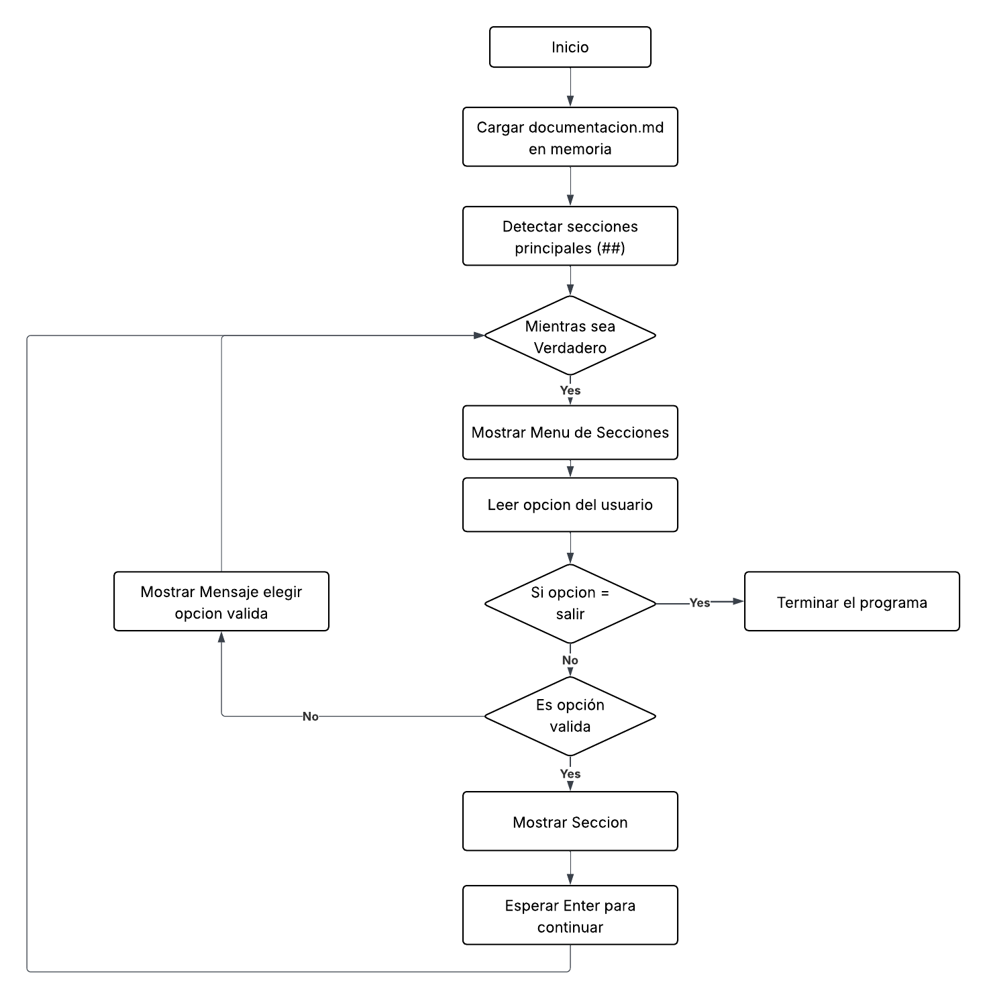

# Proyecto: Análisis de Ventas – Tienda Aurelion

---

## Tema, problema y solución

Tema

- Análisis descriptivo de un conjunto de datos de ventas minoristas para la tienda (clientes, productos, ventas y detalle de ventas). Los datos permiten estudiar comportamientos de compra, ingresos por producto y análisis por ciudad y medio de pago.

Problema

- Los archivos entregados están en CSV separados y sin documentación formal. Esto dificulta su reutilización, la verificación de calidad de datos y la reproducibilidad de análisis.
- Preguntas concretas que surgen de los datos:
  - ¿Qué productos generan mayor ingreso total?
  - ¿Cuáles son los productos con mayor volumen (cantidad vendida)?
  - ¿Qué medios de pago son más usados por ciudad?
  - ¿Hay inconsistencias entre precios en `productos.csv` y `detalle_ventas.csv`?

Solución

- Entregar documentación técnica que describa cada dataset, su estructura, tipos y escala de medición. Además, proporcionar un script interactivo en Python (`consulta_documentacion.py`) que permita explorar la documentación y los CSV (esquema y filas de ejemplo), facilitando respuestas rápidas a las preguntas anteriores y sirviendo como base para análisis posteriores.

Los archivos fuente mencionados y su relación con las preguntas anteriores:

- `clientes.csv` — identifica clientes y ciudad de residencia (permite análisis por ciudad y recuento de clientes activos).
- `productos.csv` — catálogo y precios de referencia (permite calcular ingresos totales y detectar discrepancias con precios en `detalle_ventas.csv`).
- `ventas.csv` — cabecera de cada operación (fecha, cliente, medio de pago) — necesario para análisis temporales y por medio de pago.
- `detalle_ventas.csv` — líneas de venta por producto (cantidad, precio_unitario, importe) — usado para calcular ingresos por producto y verificar consistencia de montos.

---

## Dataset de referencia (detalle por archivo: definición, estructura, tipos y escala de medición)

Fuente de datos:

- `clientes.csv`
- `productos.csv`
- `ventas.csv`
- `detalle_ventas.csv`

clientes.csv

- Descripción: registro de clientes.
- Columnas:
  - `id_cliente` — entero — tipo: identificador; escala: nominal (clave única por cliente).
  - `nombre_cliente` — texto — escala: nominal.
  - `email` — texto — escala: nominal (identificación de contacto; puede repetirse o cambiar).
  - `ciudad` — texto — escala: nominal (unidad geográfica).
  - `fecha_alta` — fecha (YYYY-MM-DD) — escala: intervalo/temporal (permite ordenar por antigüedad).

productos.csv

- Descripción: catálogo de productos y precios de referencia.
- Columnas:
  - `id_producto` — entero — identificador (nominal).
  - `nombre_producto` — texto — nominal.
  - `categoria` — texto — nominal (p. ej. Alimentos, Limpieza).
  - `precio_unitario` — entero (moneda en unidad mínima, p. ej., centavos) — escala: razón (ratio).

ventas.csv

- Descripción: cabecera de las ventas (registro por operación).
- Columnas:
  - `id_venta` — entero — identificador (nominal).
  - `fecha` — fecha (YYYY-MM-DD) — escala: intervalo/temporal.
  - `id_cliente` — entero — clave foránea a `clientes.id_cliente` (nominal).
  - `nombre_cliente` — texto — réplica para trazabilidad (nominal).
  - `email` — texto — réplica (nominal).
  - `medio_pago` — texto — nominal (categorías: efectivo, qr, tarjeta, transferencia).

detalle_ventas.csv

- Descripción: detalle de líneas por venta (productos vendidos).
- Columnas:
  - `id_venta` — entero — clave foránea a `ventas.id_venta` (nominal).
  - `id_producto` — entero — clave foránea a `productos.id_producto` (nominal).
  - `nombre_producto` — texto — nominal.
  - `cantidad` — entero — escala: razón (unidades vendidas).
  - `precio_unitario` — entero — escala: razón.
  - `importe` — entero — escala: razón (subtotal por línea; esperado igual a `cantidad * precio_unitario`).

Calidad y notas

- Hay redundancia intencional en las tablas (`nombre_cliente` y `email` aparecen en `ventas.csv`, `nombre_producto` y `precio_unitario` aparecen en `detalle_ventas.csv`). Esta redundancia facilita auditoría pero puede originar inconsistencias si no se sincroniza con el catálogo (`productos.csv`).
- Se observan nombres y emails duplicados en `clientes.csv` (mismo nombre con distinto email), por lo que se recomienda usar `id_cliente` para joins.
- Los precios están en enteros; antes de reportes financieros conviene convertir a formato decimal (dividir por 100 si se trabaja en centavos) o documentar la unidad monetaria.

---

## Información, pasos, pseudocódigo y diagrama del programa

Objetivo del script

- Permitir al usuario consultar la documentación (`documentacion.md`) mediante una interfaz de línea de comandos (CLI) simple y robusta que detecta automáticamente las secciones del documento.

Pasos de alto nivel

1. Cargar `documentacion.md` desde la raíz del proyecto.
2. Parsear automáticamente las secciones (encabezados que empiezan con ##).
3. Mostrar un menú numerado dinámico con todas las secciones encontradas.
4. Permitir al usuario navegar por cualquier sección seleccionando su número.
5. Mostrar el contenido formateado y esperar confirmación antes de volver al menú.

Pseudocódigo

```text
Inicio
  Cargar documentacion.md en memoria
  Detectar secciones principales (##)
  Mientras sea Verdadero:
    Mostrar menú numerado con todas las secciones encontradas
    Leer opción del usuario
    Si opción es válida:
      Mostrar contenido de la sección seleccionada
      Esperar Enter para continuar
    Si opción == salir:
      Terminar programa
    Si opción inválida:
      Mostrar mensaje de error
  Fin Mientras
Fin
```

## Diagrama de flujo visual

A continuación se presenta el diagrama de flujo completo del programa:



_Figura 1: Flujo de procesamiento de la documentación y navegación por menús_

Flujo de datos simplificado

```text
 ┌────────────────────────┐
 │        INICIO          │
 └───────────┬────────────┘
             │
             ▼
 ┌────────────────────────┐
 │ Cargar documentacion.md│
 │ en memoria             │
 └───────────┬────────────┘
             │
             ▼
 ┌────────────────────────┐
 │ Detectar secciones     │
 │ principales ("##")     │
 └───────────┬────────────┘
             │
             ▼
      ┌───────────────┐
      │     Bucle     │<─────────────────────────────────┐
      │   WHILE TRUE  │                    │             │
      └───────┬───────┘                    │             │
              │                            │             │
              ▼                            │             │
  ┌───────────────────────┐                │             │
  │     Mostrar menú      │                │             │
  │     de secciones      │                │             │
  └──────────┬────────────┘                │             │
             │                             │             │
             ▼                             │             │
  ┌───────────────────────────┐            │             │
  │ Leer opción del usuario   │            │             │
  └──────────┬────────────────┘            │             │
             │                             │             │
             │                             │             │
             ▼                             │             │
┌────────────────────┐       ┌───────┐     │             │
│ ¿Opción == salir?  │─ Sí ─►│  Fin  │     │             │
└───────┬────────────┘       └───────┘     │             │
        │ No                               │             │
        ▼                                  │             │
┌────────────────────┐       ┌───────────────────────┐   │
│ ¿Opción válida?    │─ No ─►│ Mostrar mensaje error │   │
└───────┬────────────┘       └───────────────────────┘   │
        │ Sí                                             │
        ▼                                                │
┌────────────────────────────┐                           │
│ Mostrar contenido sección  │                           │
└───────┬────────────────────┘                           │
        │                                                │
        ▼                                                │
┌────────────────────────────┐                           │
│ Esperar Enter para seguir  │                           │
└───────────┬────────────────┘                           │
            │                                            │
            └───────────────► (vuelve al WHILE) ──────────
```

## Sugerencias y mejoras aplicadas con Copilot, aceptadas y descartadas

Durante el desarrollo se consultaron sugerencias de Copilot y se aplicaron mejoras iterativas. A continuación se documentan las decisiones tomadas:

### ✅ **Sugerencias Aceptadas e Implementadas**

1. **Interfaz gráfica moderna con CustomTkinter**

   - **Sugerencia**: Implementar GUI además de CLI
   - **Implementación**: Aplicación completa con navegación lateral, temas claro/oscuro, y detección automática de archivos MD
   - **Resultado**: Experiencia visual mejorada para usuarios no técnicos

2. **Aplicación web con Streamlit**

   - **Sugerencia**: Crear versión web navegable
   - **Implementación**: Interfaz compacta con sidebar, búsqueda, y carga de múltiples documentos
   - **Resultado**: Acceso desde navegador sin instalación

3. **Reorganización de estructura del proyecto**

   - **Sugerencia del usuario**: Mover archivos principales a la raíz para facilitar acceso
   - **Decisión inicial**: Archivos MD en raíz
   - **Decisión final**: Volver a estructura organizada (`docs/`, `images/`, `utils/`)
   - **Resultado**: Proyecto profesional y escalable

4. **Mejoras en experiencia CLI**

   - **Sugerencia**: Agregar limpieza de pantalla después de cada sección
   - **Implementación**: Función `clear_screen()` multiplataforma
   - **Resultado**: Navegación más limpia y profesional

5. **Priorización de archivos en GUI**
   - **Sugerencia del usuario**: `documentacion.md` debería aparecer primero, no `README.md`
   - **Implementación**: Función de ordenamiento personalizada con prioridades
   - **Resultado**: Archivo principal más accesible

### ❌ **Sugerencias Descartadas**

1. **Funcionalidades de análisis de CSV**

   - **Razón**: El proyecto evolucionó hacia explorador de documentación Markdown puro
   - **Impacto**: Mayor enfoque y simplicidad del proyecto

2. **Múltiples formatos de exportación complejos**

   - **Razón**: Añadiría complejidad innecesaria para el alcance actual
   - **Alternativa**: Se mantuvieron las 3 interfaces como salidas principales

3. **Base de datos para indexación**
   - **Razón**: Overkill para documentos Markdown pequeños a medianos
   - **Alternativa**: Parsing en memoria más simple y eficiente

### 🔄 **Iteraciones y Refinamientos**

- **Pseudocódigo actualizado**: Se corrigió para reflejar la implementación real (sin hardcoding de secciones)
- **Rutas de archivos**: Múltiples ajustes para soportar estructura cambiante del proyecto
- **Documentación**: Simplificación de secciones obsoletas y enfoque en funcionalidad actual

---

## Contacto

Para más información, contactar al responsable del proyecto:  
Mónica Guantay - email: [mbguantay@gmail.com](mailto:mbguantay@gmail.com)
